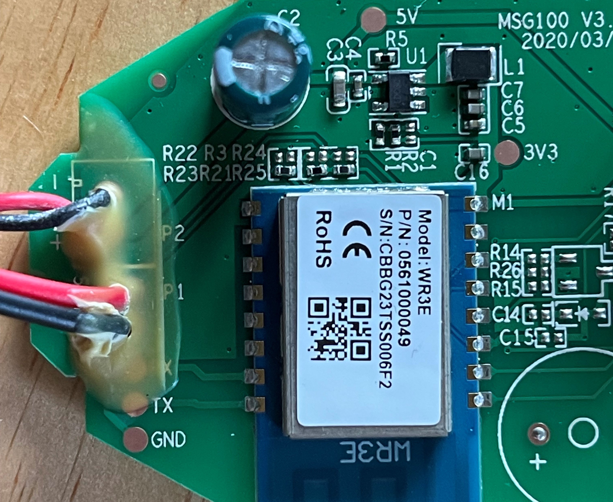

# Lomota Smart Wi-Fi Garage Door Opener Remote

I found [this device](https://www.amazon.com/gp/product/B086MKP14K) on sale during Amazon's Prime Day. It caught my eye because what could possibly go wrong in putting your garage door opener on your WiFi network? 

I took it apart, and didn't find much immediately available. 

There appears to be UART pads in place, although I'll need to figure out how to get the glue stuff off without damaging them. 

I also did some research on the specific WR3E chip. They have [documentation](https://developer.tuya.com/en/docs/iot/burn-and-authorize-wr-series-modules?id=Ka789pjc581u8) on how to flash the chip, but I'm going to need to figure out what the best route will be for physically connecting it since I'm more limited than what's demonstrated in this guide. 

Next steps: Probably figuring out how to solder pins on to those assumed UART pads. 