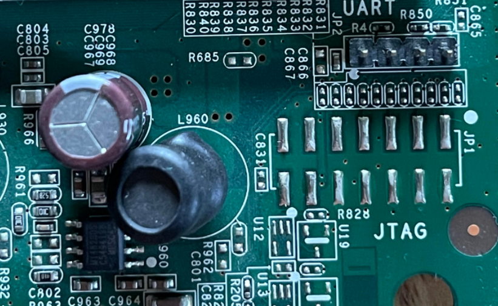

# Netgear N600 Wireless Dual Band Gigabit Router

For my first device, I took apart an old, outdated Netgear router I already had lying around. 

The board has clearly marked UART and JTAG connectors. I decided to start with UART, since the pins are already there. 

I began by identifying the pins using a multimeter. 

Pin 1 = Vcc
Pin 2 = RX
Pin 3 = TX
Pin 4 = Ground

I used a [Bus Pirate](https://www.adafruit.com/product/237) to attempt to interface with the UART connectors. I used the corresponding [UART guide](https://dangerousprototypes.com/blog/bus-pirate-manual/bus-pirate-uart-guide/) and made sure I had the correct pins in place. 

Using `screen /dev/ttyUSB0 256000`, I attempted to boot the router. This did not work, no matter what baud rate I used. I went back to the drawing board and used a cheap logic analyzer to make sure I correctly identified all of the pins. I lost the screenshot of this, but using PulseView, I did confirm that the pins were correctly identified. 

I tried a different breakout board, the [Adafruit FT232](https://www.adafruit.com/product/2264), and still had no luck. This leads me to believe that the UART interface is disabled. 

Next steps: learn how to solder better and try the JTAG connectors. 